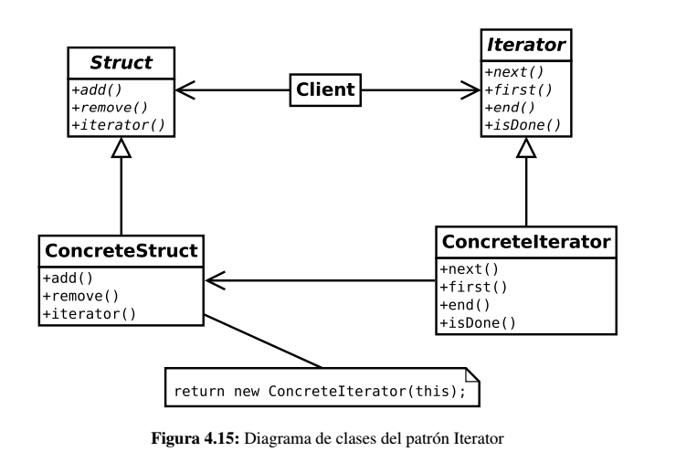

# Iterator

Se utiliza para ofrecer una interfaz de acceso secuencial a una determinada estructura ocultando la representación interna 
y la forma en que realmente se accede.

## Problema

Manejar colecciones de datos es algo muy habitual en el desarrollo de aplicaciones. Listas, pilas y, sobre todo, árboles 
son ejemplos de estructuras de datos muy presentes en los juegos y se utilizan de forma intensiva.

Una operación muy habitual es recorrer las estructuras para analizar y/o buscar los datos que contienen. Es posible que 
sea necesario recorrer la estructura de forma secuencial, de dos en dos o, simplemente, de forma aleatoria. Los clientes 
suelen implementar el método concreto con el que desean recorrer la estructura por lo que puede ser un problema si, por ejemplo, 
se desea recorrer una misma estructura de datos de varias formas distintas. Conforme aumenta las combinaciones entre los tipos de
estructuras y métodos de acceso, el problema se agrava.

## Solución

La solución que propone el patrón *Iterador* es añadir métodos que permitan recorrer la estructura sin referenciar explícitamente
su representación, es decir, sin exponer su representación interna. La responsabilidad del recorrido se traslada a un objeto iterador.

El problema de introducir este objeto iterador reside en que los clientes necesitan conocer la estructura para crear el iterador apropiado.
Esto se soluciona generalizando los distintos iteradores en una abstracción y dotando a las estructuras de datos de un método
de fabricación que cree un iterador concreto.

Diferentes iteradores pueden presentar diferentes tipos de recorrido sobre la estructura. No sólo eso, sino que podrían incorporar
funcionalidad extra como por ejemplo filtrado de elementos, etc..

## Implementación

Como puede verse, la estructura de datos es la encargada de crear el iterador adecuado para ser accedida a través del método 
*iterator()*. Una vez que el cliente ha obtenido el iterador, puede utilizar los métodos de acceso que ofrecen tales como
*next()* (para obtener el siguiente elemento) o *isDone()* para comprobar si existen más elementos.

## Enlaces
* [Iterator](https://es.wikipedia.org/wiki/Iterador_%28patr%C3%B3n_de_dise%C3%B1o%29)

License
-------
    Copyright (c) 2018 @alxgcrz <alxgcrz@outlook.com>
    
    Licensed under the Apache License, Version 2.0 (the "License");
    you may not use this file except in compliance with the License.
    You may obtain a copy of the License at
    
       http://www.apache.org/licenses/LICENSE-2.0
    
    Unless required by applicable law or agreed to in writing, software
    distributed under the License is distributed on an "AS IS" BASIS,
    WITHOUT WARRANTIES OR CONDITIONS OF ANY KIND, either express or implied.
    See the License for the specific language governing permissions and
    limitations under the License.
