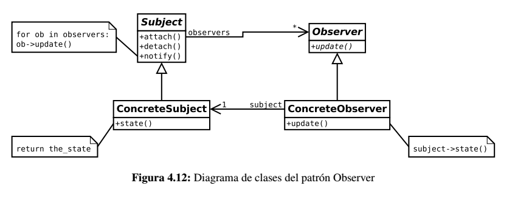

# Observer (patrón de comportamiento)

Los patrones de comportamiento se definen como patrones de diseño software que ofrecen soluciones respecto a la interacción y responsabilidades entre clases y objetos, así como los algoritmos que encapsulan.

El **patrón Observer** se utiliza para definir relaciones 1 a *n* de forma que un objeto pueda notificar y/o actualizar el estado de otros automáticamente.

## Problema

En el patrón *MVC* el dominio puede notificar de cambios a las diferentes vistas. Es importante que el dominio no conozca
los tipos concretos de vistas, de forma que no haya que modificar el dominio en caso de añadir o quitar una vista.

## Solución

El patrón *Observer* proporciona un diseño con **poco acomplamiento** entre los *observadores* y el objeto *observado*.

Siguiendo la filosofía de *publicación/suscripción*, los objetos observadores se deben registrar en el objeto observado
llamado **sujeto** pasándole una referencia de si mismo. El sujeto mantiene una lista de de las referencias de los observadores.

Además, los observadores a su vez están obligados a implementar unos métodos determinados mediante los cuales el **sujeto** es capaz
de notificar a los observadores suscritos los cambios que sufre para que todos ellos tengan constancia. Por tanto, cuando el evento oportuno, el sujeto recibirá una invocación y será el encargado de "notificar" a todos los elementos suscritos a él.

Los observadores que reciben la invocación pueden realizar las acciones pertinentes como consultar el estado del dominio para obtener nuevos valores.

## Aplicabilidad

Puede pensarse en aplicar este patrón cuando una modificación en el estado de un objeto requiere cambios de otros, y no se desea que se conozca el número de objetos que deben ser cambiados. También cuando queremos que un objeto sea capaz de notificar a otros objetos sin hacer ninguna suposición acerca de los objetos notificados y cuando una abstracción tiene dos aspectos diferentes, que dependen uno del otro; si encapsulamos estos aspectos en objetos separados permitiremos su variación y reutilización de modo independiente.

## Enlaces

* [Observer (patrón de diseño)](https://es.wikipedia.org/wiki/Observer_%28patr%C3%B3n_de_dise%C3%B1o%29)

## License

  
Esta obra está bajo una [licencia de Creative Commons Reconocimiento-Compartir Igual 4.0 Internacional](http://creativecommons.org/licenses/by-sa/4.0/).
