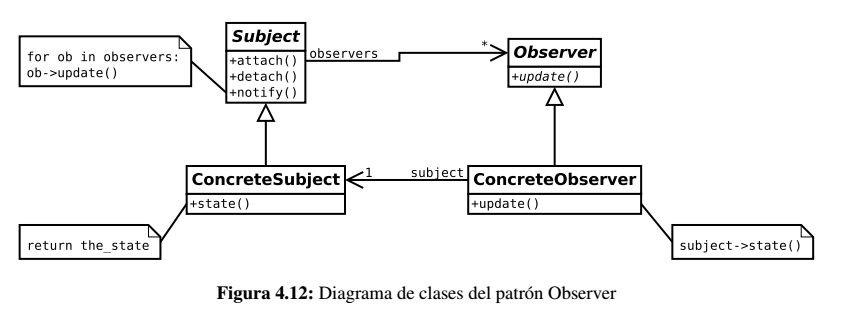

# Observer

Se utiliza para definir relaciones 1 a *n* de forma que un objeto pueda notificar y/o actualizar el estado de otros automáticamente.

## Problema

En el patrón *MVC* el dominio puede notificar de cambios a las diferentes vistas. Es importante que el dominio no conozca
los tipos concretos de vistas, de forma que no haya que modificar el dominio en caso de añadir o quitar una vista.

## Solución

El patrón *Observer* proporciona un diseño con **poco acomplamiento** entre los *observadores* y el objeto *observado*.

Siguiendo la filosofía de *publicación/suscripción*, los objetos observadores se deben registrar en el objeto observado
llamado **sujeto*** pasándole una referencia de si mismo. El sujeto mantiene una lista de de las referencias de los observadores.

Además, los observadores a su vez están obligados a implementar unos métodos determinados mediante los cuales el **Sujeto** es capaz
de notificar a los observadores suscritos los cambios que sufre para que todos ellos tengan constancia. Por tanto, cuando el 
evento oportuno, el sujeto recibirá una invocación y será el encargado de "notificar" a todos los elementos suscritos a él.

Los observadores que reciben la invocación pueden realizar las acciones pertinentes como consultar el estado del dominio para 
obtener nuevos valores.

## Aplicabilidad

Puede pensarse en aplicar este patrón cuando una modificación en el estado de un objeto requiere cambios de otros, y no 
se desea que se conozca el número de objetos que deben ser cambiados. También cuando queremos que un objeto sea capaz de 
notificar a otros objetos sin hacer ninguna suposición acerca de los objetos notificados y cuando una abstracción tiene 
dos aspectos diferentes, que dependen uno del otro; si encapsulamos estos aspectos en objetos separados permitiremos su 
variación y reutilización de modo independiente.

## Enlaces
* [Observer](https://es.wikipedia.org/wiki/Observer_%28patr%C3%B3n_de_dise%C3%B1o%29)
