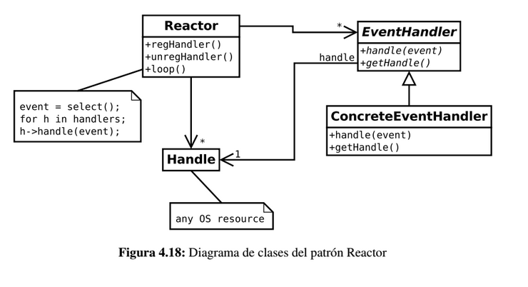

# Reactor

Es un patrón arquitectural para resolver el problema de cómo atender peticiones concurrentes a través de señales y manejadores de señales.

## Problema

Existen aplicaciones, como los servidores web, cuyo comportamiento es *reactivo*, es decir, a partir de la ocurrencia de 
un evento externo se realizan todas las operaciones necesarias para atender a ese evento externo. En el caso del servidor 
web, una conexión entrante **(evento)** dispararía la ejecución del código pertinente que crearía un hilo de ejecución para 
atender a dicha conexión. Pero también pueden tener comportamiento *proactivo*. Por ejemplo, una señal interna puede indicar 
cuándo destruir una conexión con un cliente que lleva demasiado tiempo sin estar accesible. 

En los videojuegos ocurre algo muy similar: diferentes entidades pueden lanzar eventos que deben ser tratados en el momento 
en el que se producen. Por ejemplo, la pulsación de un botón en el joystick de un jugador es un evento que debe ejecutar el 
código pertinente para que la acción tenga efecto en el juego.

## Implementación

* **Eventos** - los eventos externos que pueden ocurrir sobre los recursos **(Handles)**. Normalmente su ocurrencia es asíncrona
y siempre está relacionada a un recurso determinado.

* **Recursos (Handles)** - se refiere a los objetos sobre los que ocurren los eventos.

* **Manejadores de Eventos** - Asociados a los recursos y a los eventos que se producen en ellos, se encuentran los manejadores
de eventos **(EventHandler)** que reciben una invocación a través del método **handle()** con la información del evento que 
se ha producido.

* **Reactor** - se trata de la clase que encapsula todo el comportamiento relativo a la desmultiplexación de los eventos en
manejadores de eventos **(dispatching)**. Cuando ocurre cierto evento, se busca los manejadores asociados y se les invoca
el método **handle()**.

## Comportamiento

1. Los manejadores se registran usando el método *regHandler()* del **Reactor**. De esta forma, el Reactor puede configurarse
para esperar los eventos del recurso que el manejador espera. El manejador puede dejar de recibir notificaciones con *unregHandler()*

1. A continuación, el Reactor entra en el bucle infinito *(loop())*, en el que se espera la ocurrencia de eventos.

1. Utilizando alguna llamada al sistema, como puede ser *select()*, el Reactor espera a que se produzca algún evento sobre
los recursos monitorizados.

1. Cuando ocurre, busca los manejadores asociados a ese recurso y les invoca el método *handle()* con el evento que ha ocurrido
como parámetro.

1. El manejador recibe la invocación y ejecuta todo el código asociado al evento.

## Consideraciones

Aunque los eventos puede ocurrir de forma concurrente, el Reactor serializa las llamadas a los manejadores. Por lo tanto, la ejecución
de los manejadores de eventos ocurre de forma **secuencial**

Para evitar que el sistema quede inoperable, los manejadores de enventos no pueden consumir mucho tiempo. En general, cuanto mayor
sea la frecuencia en que ocurren los eventos, menos tiempo deben consumir los manejadores.

Desde un punto de vista general, el patrón *Reactor* tiene un comportamiento muy parecido al patrón *Observer*. Sin embargo,
el patrón *Reactor* está pensado para las relaciones **1 a 1** mientras que en el caso del patrón *Observer* se producen relaciones **1 a n**.

## Enlaces
* [Reactor](https://es.wikipedia.org/wiki/Reactor_%28patr%C3%B3n_de_dise%C3%B1o%29)

License
-------
    Copyright (c) 2018 @alxgcrz <alxgcrz@outlook.com>
    
    Licensed under the Apache License, Version 2.0 (the "License");
    you may not use this file except in compliance with the License.
    You may obtain a copy of the License at
    
       http://www.apache.org/licenses/LICENSE-2.0
    
    Unless required by applicable law or agreed to in writing, software
    distributed under the License is distributed on an "AS IS" BASIS,
    WITHOUT WARRANTIES OR CONDITIONS OF ANY KIND, either express or implied.
    See the License for the specific language governing permissions and
    limitations under the License.
