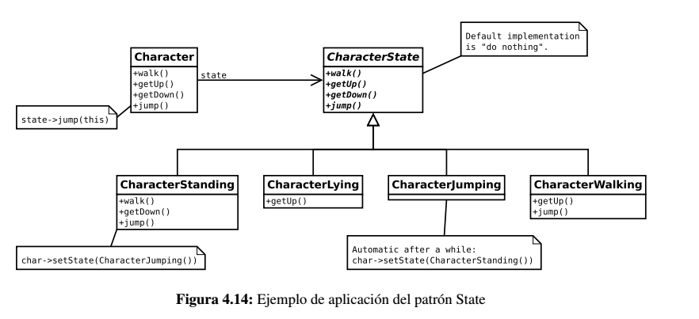

# State

Se utiliza cuando el comportamiento de un objeto cambia dependiendo del estado del mismo.

## Problema

Es muy común que en cualquier aplicación, incluído los videojuegos, existan estructuras que pueden ser modeladas 
directamente como un autómata, es decir, una colección de estados y unas transiciones dependientes de una entrada. 
En este caso, la entrada pueden ser invocaciones y/o eventos recibidos. Por ejemplo, los estados de un personaje de un 
videojuego podrían ser: de pie, tumbado, andando y saltando. Dependiendo del estado en el que se encuentre y de la invocación 
recibida, el siguiente estado será uno u otro. Por ejemplo, si está de pie y recibe la orden de tumbarse, ésta se podrá 
realizar. Sin embargo, si ya está tumbado no tiene sentido volver a tumbarse, por lo que debe permanecer en ese estado.

## Solución

El patrón State permite encapsular el mecanismo de las transiciones que sufre un objeto a partir de los estímulos externos. 
A continuación se muestra un ejemplo de aplicación del mismo. La idea es crear una clase abstracta que representa al estado 
del personaje (CharacterState). En ella se definen las mismas operaciones que puede recibir el personaje con una 
implementación por defecto. En este caso, la implementación es vacía.

Por cada estado en el que puede encontrarse el personaje, se crea una clase que hereda de la clase abstracta anterior, 
de forma que en cada una de ellas se implementen los métodos que producen cambio de estado.

Por ejemplo, según el diagrama, en el estado "de pie" se puede recibir la orden de caminar, tumbarse y saltar, pero no 
de levantarse. En caso de recibir esta última, se ejecutará la implementación por defecto, es decir, no hacer nada.

En definitiva, la idea es que las clases que representan a los estados sean las encargadas de cambiar el estado del 
personaje, de forma que los cambios de estados quedan encapsulados y delegados al estado correspondiente.

## Consideraciones

Los componentes de diseño que se comporten como autómatas son buenos candidatos a ser modelos con el patrón *State*

Es posible que una entrada provoque una situación de error estando en un determinado estado. Para ello es posible utilizar
las excepciones para notificar dicho error.

Las clases que representan los estados **no** deben mantener un estado intrínseco, es decir, no se debe hacer uso de variables
que dependan de un contexto.

## Enlaces
* [State](https://es.wikipedia.org/wiki/State_%28patr%C3%B3n_de_dise%C3%B1o%29)
