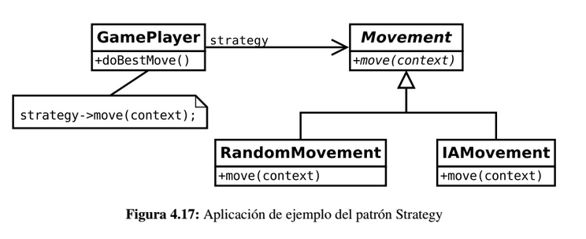

# Strategy

Permite disponer de varios métodos para resolver un problema y elegir cuál utilizar en tiempo de ejecución.

## Problema

En muchas ocasiones, se suele proporcionar diferentes algoritmos para realizar una misma tarea. Por ejemplo, el nivel de 
habilidad de un jugador viene determinado por diferentes algoritmos y heurísticas que determinan el grado de dificultad. 
Utilizando diferentes tipos algoritmos podemos obtener desde jugadores que realizan movimientos aleatorios hasta aquellos 
que pueden tener cierta inteligencia y que se basan en técnicas de IA. 

Lo deseable sería poder tener jugadores de ambos tipos y que, desde el punto de vista del cliente, no fueran tipos distintos 
de jugadores. Simplemente se comportan diferente porque usan distintos algoritmos internamente, pero todos ellos son jugadores.

Otro ejemplo para entender este patrón es el de un protagonista de un videojuego en el cual manejamos a un soldado que 
puede portar y utilizar varias armas distintas. La clase (o clases) que representan a nuestro soldado no deberían de 
preocuparse de los detalles de las armas que porta: debería bastar, por ejemplo, con un método de interfaz "atacar" que 
dispare el arma actual y otro método "recargar" que inserte munición en ésta (si se diera el caso). En un momento dado, 
otro método "cambiarArma" podrá sustituir el objeto equipado por otro, manteniendo la interfaz intacta. 

Da igual que nuestro soldado porte un rifle, una pistola o un fusil: los detalles de cada estrategia estarán encapsulados 
dentro de cada una de las clases intercambiables que representan las armas. Nuestra clase cliente (el soldado) únicamente 
debe preocuparse de las acciones comunes a todas ellas: atacar, recargar y cambiar de arma. Éste último método, de hecho, 
será el encargado de realizar la operación de "cambio de estrategia" que forma parte del patrón.

## Solución

Mediante el uso de la herencia, el patrón *Strategy* permite encapsular diferentes algoritmos para que los clientes puedan
utilizarlos de forma transparente.

La idea es extraer los métodos que conforman el comportamiento que puede ser intercambiado y encapsularlo en una familia de
algoritmos. En este ejemplo, el movimiento del jugador se extrae para formar una jerarquía de diferentes movimientos *(Movement)*. 
Todos ellos implementan el método *move()* que recibe un contexto que incluye toda la información necesaria para llevar a cabo el algoritmo.

El siguiente fragmento de código indica cómo se usa este esquema por parte de un cliente. Nótese que al configurarse cada 
jugador, ambos son del mismo tipo de cara al cliente aunque ambos se comportarán de forma diferente al invocar al método 
*doBestMove()*.

## Consideraciones

El patrón *Strategy* es una buena alternativa a realizar subclases en las entidades que deben comportarse de forma diferente
en función del algoritmo utilizado. Al extraer la heurística a una familia de algoritmos externos, obtenemos los siguientes
beneficios:

* Se aumenta la reutilización de dichos algoritmos.
* Se evitan sentencias condicionales para elegir el comportamiento deseado.
* Los clientes pueden elegir diferentes implementaciones para un mismo comportamiento deseado, por lo que es útil para depuración
y pruebas donde se pueden escoger implementaciones más simples y rápidas.

Este patrón es aconsejable, como ya hemos comentado, en situaciones en los que una misma operación (o conjunto de operaciones) 
puedan realizarse de formas distintas. A grosso modo, el patrón *Strategy* realiza una tarea bastante similar al patrón *Template Method*, 
salvo porque en este caso el algoritmo no tiene por qué contar con pasos en común y porque *Strategy* confía en la composición 
mientras que *Template Method* se basa en la herencia.

## Enlaces
* [Strategy](https://es.wikipedia.org/wiki/Strategy_%28patr%C3%B3n_de_dise%C3%B1o%29)
* [Ejemplo](https://danielggarcia.wordpress.com/2014/05/12/patrones-de-comportamiento-iv-patron-strategy/)
