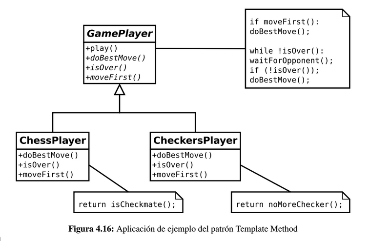

# Template Method

Define en una operación el esqueleto de un algoritmo, delegando en las subclases algunos de sus pasos. Esto permite
que las subclases redefinan ciertos pasos de un algoritmo sin cambiar su estructura.

## Problema

En un buen diseño los algoritmos complejos se dividen en funciones más pequeñas, de forma que si se llama a dichas funciones 
en un determinado orden se consigue implementar el algoritmo completo. Conforme se diseña cada paso concreto, se suele
ir detectando funcionalidad común con otros algoritmos.

Por ejemplo, supongamos que tenemos dos tipos de jugadores de juegos de mesa: ajedrez y damas. En esencia, ambos juegan 
igual; lo que cambia son las reglas del juego que, obviamente, condiciona su estrategia y su forma de jugar concreta. Sin 
embargo, en ambos juegos, los jugadores mueven en su turno, esperan al rival y esto se repite hasta que acaba la partida.

El patrón *Template Method* consiste extraer este comportamiento común en una clase padre y definir en las clases hijas 
la funcionalidad concreta.

Si el patrón *Command* nos permite encapsular una invocación a un método, el patrón *Template Method* o Método Modelo 
establece una forma de encapsular algoritmos. Este patrón se basa en un principio muy sencillo: si un algoritmo puede 
aplicarse a varios supuestos en los que únicamente cambie un pequeño número de operaciones, la idea será utilizar una 
clase para modelarlo a través de sus operaciones. Esta clase base se encargará de definir los pasos comunes del algoritmo, 
mientras que las clases que hereden de ella implementarán los detalles propios de cada caso concreto, es decir, el 
código específico para cada caso.

## Solución

Siguiendo con el juego del ajedrez y las damas, tenemos un ejemplo de posible aplicación del patrón *Template Method*.

La clase *GamePlayer* es la que implementa el método *play()* que es el que invoca a los otros métodos que son implementados
por las clases hijas. Este método es el *método plantilla*.

Cada tipo de jugador define los métodos en base a las reglas y heurísticas de su juego. Por ejemplo, el método *isOver()* 
indica si el jugador ya no puede seguir jugando porque se ha terminado el juego. En caso de las damas, el juego se acaba 
para el jugador si se ha quedado sin fichas; mientras que en el caso ajedrez puede ocurrir por jaque mate (además de otros motivos).

## Implementación

* Se declara una clase abstracta, que será la plantilla o modelo. Esta clase definirá una serie de funciones y métodos. 
Aquellas que sean comunes estarán implementadas. Aquellas que dependan de cada caso concreto, se declararán como abstractas, 
obligando a las clases hijas a implementarlas.

* Cada clase derivada implementará los métodos específicos, acudiendo a la clase base para ejecutar el código común. 

* La clase base también se encargará de la lógica del algoritmo, ejecutando los pasos en un orden preestablecido 
(las clases hijas no deberían poder modificar el algoritmo, únicamente definir la funcionalidad específica que tienen que implementar).

Dado que la clase padre es la que se encarga de llamar los métodos de las clases derivadas (los pasos del algoritmo estarán 
implementado en la clase base), se trata de una aplicación manifiesta del principio de **inversión de dependencias**: 
la clase base no tiene por qué saber nada acerca de sus hijas, pero aún así, se encargará de invocar su funcionalidad 
cuando sea necesario. El principio de Hollywood (“no nos llames, nosotros te llamaremos”) vuelve a entrar en escena.

## Consideraciones

* Utilizando el patrón *Template Method* se suelen obtener estructuras altamente reutilizables.

* Introduce el concepto de operaciones *hook* que, en caso de no estar implementadas en las clases hijas, tienen una 
implementación por defecto. Las clases hijas pueden sobreescribirlas para añadir su propia funcionalidad.

## Enlaces
* [Template Method](https://es.wikipedia.org/wiki/Template_Method_%28patr%C3%B3n_de_dise%C3%B1o%29)
* [Ejemplo](https://danielggarcia.wordpress.com/2014/05/05/patrones-de-comportamiento-iii-template-method/)
