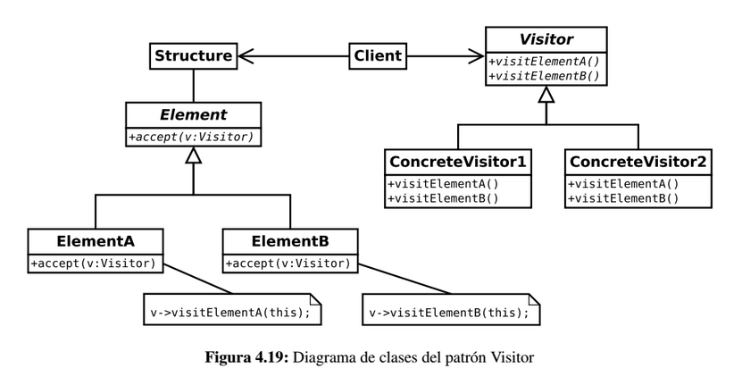

# Visitor

Permite definir nuevas operaciones sobre una jerarquía de clases sin modificar las clases sobre las que opera.

El patrón *Visitor* proporciona un mecanismo para realizar diferentes operaciones sobre una jerarquía de objetos de forma 
que añadir nuevas operaciones no haga necesario cambiar las clases de los objetos sobre los que se realizan las operaciones.

En el diseño de un programa, normalmente se obtienen jerarquías de objetos a través de herencia o utilizando el patrón 
*Composite*. Considerando una jerarquía de objetos que sea más o menos estable, es muy probable que necesitemos realizar 
operaciones sobre dicha jerarquía. Sin embargo, puede ser que cada objeto deba ser tratado de una forma diferente en función 
de su tipo. La complejidad de estas operaciones aumenta muchísimo.

## Ejemplo

* *Método simple sin usar este patrón:* supongamos un veterinario a domicilio, que con base en al animal que tiene que curar 
sabe qué cura tiene que aplicar. Es responsabilidad del veterinario el saber de qué clase es el animal y sobre la base de ello aplicar la cura.

* *Método usando el patrón:* El veterinario no tiene que reconocer al animal ni saber qué cura aplicarle. Es el propio 
animal el que le dice al veterinario qué cura es más apropiada para él. El veterinario sólo "visita" al animal, y aplica la cura apropiada.

## Solución

Participantes en el patrón *Visitor*:

* **Visitables:** son los elementos de la estructura de objetos que aceptan a un determinado visitante y que le proporcionan 
toda la información a éste para realizar una determinada operación. Definen una operación "Accept" que toma un visitante como argumento.

* **Visitantes:** jerarquía de objetos que realizan una operación determinada sobre dichos elementos.

Cada visitante concreto realiza una operación sobre la estructura de objetos. Es posible que al visitante no le interesen 
todos los objetos y, por lo tanto, la implementación de alguno de sus métodos sea vacía. 

Sin embargo, lo importante del patrón *Visitor* es que se pueden añadir nuevos tipos de visitantes concretos y, por lo 
tanto, realizar nuevas operaciones sobre la estructura sin la necesidad de modificar nada en la propia estructura.

## Consideraciones

* El patrón *Visitor* es muy conveniente para recorrer estructuras arbóreas y realizar operaciones en base a los datos almacenados.

* La forma en que se recorra la estructura influirá notablemente en el rendimiento del análisis de la estructura. Se puede hacer
uso del patrón *Iterator* para decidir cómo escoger el siguiente elemento.

* Uno de los problemas de este patrón es que no es recomendable si la estructura  de objetos cambia frecuentemente o es 
necesario añadir nuevos tipos de objetos de forma habitual. Cada nuevo objeto que sea susceptible de ser visitado puede 
provocar grandes cambios en la jerarquía de los visitantes.

## Enlaces
* [Visitor](https://es.wikipedia.org/wiki/Visitor_%28patr%C3%B3n_de_dise%C3%B1o%29)
