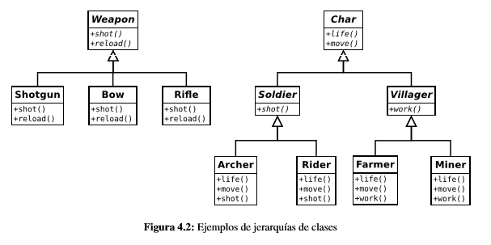

# Abstract Factory

## Problema
Conforme un programa crece, el número de clases que representan los diferentes tipos de objetos suele también crecer. 
Muchos de los diseños tienen jerarquías de  objetos tales como la que se muestra en la figura 4.2.

En ella, se muestra jerarquías de clases que modelan los diferentes tipos de personajes de un juego y algunas de sus armas. 
Para construir cada tipo de personaje es necesario saber cómo construirlo y con qué otro tipo de objetos tiene relación. 
Por ejemplo, restricciones del tipo «la gente del pueblo no puede llevar armas» o «los arqueros sólo pueden puede tener un arco», 
es conocimiento específico de la clase que se está construyendo. 

## Enunciado 

Supongamos que en nuestro juego, queremos obtener razas de personajes: hombres y orcos. Cada raza tiene una serie de 
características propias que hacen que pueda moverse más rápido, trabajar más o tener más resistencia a los ataques.

El patrón Abstract Factory puede ser de ayuda en este tipo de situaciones en las que es necesario crear diferentes tipos 
de objetos utilizando una jerarquía de componentes. Dada la complejidad que puede llegar a tener la creación de una instancia 
es deseable aislar la forma en que se construye cada clase de objeto.

## Solución

En primer lugar se define una factoría abstracta que será la que utilice el cliente (*Game*) para crear los diferentes
objetos.**CharFactory** es una factoría que sólo define métodos abstractos y que serán implementados por sus clases hijas.

Éstas son factorías concretas a cada tipo de raza (*ManFactory* y *OrcFactory*) y ellas son las que crean las instancias
concretas de objetos *Archer* y *Rider* para cada una de las razas.

