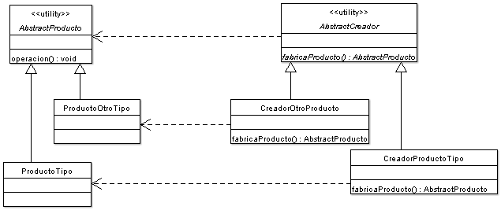

# Factory Method

## Implementación

Las clases principales de este patrón son el **creador** y el **producto**. El creador necesita crear instancias de productos,
pero el tipo concreto de producto no debe ser forzado en las subclases del creador porque las posibles subclases del 
creador deber poder especificar subclases del producto para utilizar.

La solución para esto es hacer un método abstracto (el método de la fábrica) que se define en el creador. Este método abstracto
se define para que devuelva un producto. Las subclases del creador pueden sobreescribir este método para devolver subclases 
apropiadas del producto.
