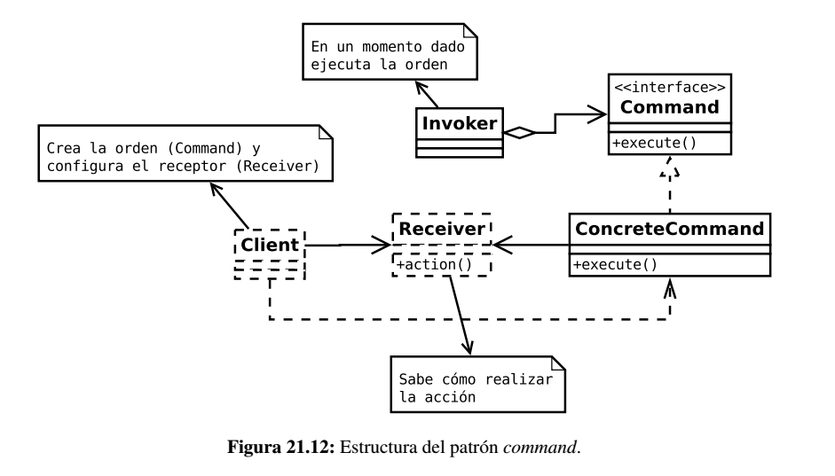
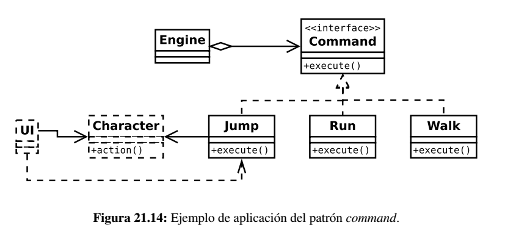

# Command (patrón de comportamiento)

Los patrones de comportamiento se definen como patrones de diseño software que ofrecen soluciones respecto a la interacción y responsabilidades entre clases y objetos, así como los algoritmos que encapsulan.

El **patrón Command (Orden)** encapsula una operación en un objeto, permitiendo ejecutar dicha operación sin necesidad de conocer el contenido de la misma.

## Problema

Existe un gran número de situaciones y escenarios en las que la relación directa entre el emisor de una orden y el receptor de la misma es insuficiente:

* La invocación directa afecta sólo a emisor y receptor por lo que resulta complicado ampliar dicha relación a otros actores, como por ejemplo barras de progreso, ayuda contextual, etc...

* A veces es necesario un modelo de ejecución transaccional (al igual que en las bases de datos) en las que es necesario que se ejecuten todas las órdenes o si en caso de que alguna falle o no sea posible ejecutar, se deshagan todas las órdenes relacionadas y se mantenga o restaure el estado anterior.

* En las aplicaciones multi-hilo, el patrón *Command* es un método sencillo para desacoplar productores y receptores de órdenes, dado que los productores y receptores pueden estar en diferentes hilos.

* En los juegos en red mayormente se necesitan ejecutar órdenes en todos los dispositivos participantes. Este patrón facilita la serialización de las órdenes ya que sólo hay que serializar los objetos que las representan.

* Muchos juegos añaden algún tipo de consola para interactuar directamente con el motor del juego empleando un intérprete de comandos. Mediante este patrón, se pueden sintetizar las órdenes como si hubieran sido producidas por el propio motor, facilitando la prueba y su depuración.

* En el uso de macros también se hace necesario el uso de este patrón.

* En el caso de los asistentes o *wizards* el patrón *Command* permite desacoplar el interfaz de usuario de las órdenes ya que una vez configurada la secuencia y tipo de órdenes desde el asistente, una vez sea aceptado por el usuario es cuando se emite el mensaje y se ejecutan dichas órdenes.

## Solución

El cliente crea los objetos *command* concretos y los asocia con el receptor de la acción. Posteriormente, y de forma totalmente
desacoplada, será un invocador el que llamará al método *execute()* de cada objeto *command* creado.

Los objetos *command* concretos implementan el método *execute()* delegando normalmente de forma total o parcial en el receptor la acción
a realizar.

## Ejemplo

El intefaz de usuario (UI) crea las órdenes a realizar por el personaje y el motor del juego va procesando las órdenes.

## Consideraciones

* Como se ha comentado, el patrón *Command* desacopla el objeto que invoca la operación del objeto que sabe realizarla.

* Las órdenes son objetos y por tanto pueden ser manipulados y extendidos como cualquier otro objeto. Además, permite que sean gestionados en colas de objetos o mantener un registro de mensajes.

* Las órdenes pueden incluir transacciones para garantizar la consistencia y estado de los objetos. Por tanto, existe la posibilidad de restaurar estados anteriores.

* Al usar objetos se facilita el uso de parámetros a la hora de ejecutar las órdenes.

En términos generales, el patrón *Command* la relación entre el *ConcreteCommand* y el *Receiver* puede ser:

* El objeto *ConcreteCommand* no realiza ninguna función por sí mismo, sino que delega todas las acciones en el objeto *Receiver*. Este tipo de órdenes se les llama **forwarding commands.**

* El objeto *ConcreteCommand* implementa absolutamente todo, sin delegar nada en el objeto *Receiver*.

Entre ambas aproximanciones se encuentran las órdenes que realizan algunas funciones en una parte y delegan otras en el receptor.
En general, a este tipo de órdenes se les denomina *active commands*.

## Enlaces

* [Command (patrón de diseño)](https://es.wikipedia.org/wiki/Command_%28patr%C3%B3n_de_dise%C3%B1o%29)

## License

  
Esta obra está bajo una [licencia de Creative Commons Reconocimiento-Compartir Igual 4.0 Internacional](http://creativecommons.org/licenses/by-sa/4.0/).
