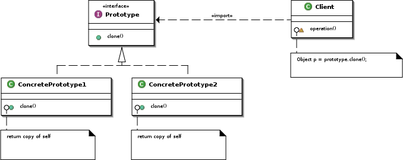

# Prototype (patrón creacional)

Los patrones creacionales corresponden a patrones de diseño de software que solucionan problemas de creación de instancias. Nos ayudan a encapsular y abstraer dicha creación.

El patrón ***Prototype*** proporciona abstracción a la hora de crear diferentes objetos en un contexto donde se desconoce cúantos y cuáles deben ser creados a priori. La idea principal es que los objetos deben poder clonarse en tiempo de ejecución. Por tanto, este patrón tiene como finalidad crear nuevos objetos duplicándolos, clonando una instancia creada previamente.

## Problema

Los patrones *Factory Method* y *Abstract Factory* tiene el problema de que se basan en la herencia e implementación de métodos abstractos por subclases para definir cómo se construye cada producto concreto. Para sistemas donde el número de productos concretos puede ser elevado o indeterminado esto puede ser un problema.

## Solución

La clase de los objetos que servirán de prototipo para la copia deberán incluir en su interfaz la manera de solicitar esa copia, que será desarrollada luego por las clases concretas de prototipos.

Este patrón se utiliza en casos como:

* Evitar las subclases de un objeto creador como hace el patrón *Abstract Factory*
* Evitar el costo inherente a la creación de un objeto nuevo mediante el operador **new** cuando esto es demasiado costoso para la aplicación.
* La decisión del tipo de objeto necesario se decide en tiempo de ejecución en función de determinados parámetros, configuraciones o condiciones en un momento dado.

Este patrón es útil para implementar *plugins* o cuando se cargan en tiempo de ejecución liberías dinámicas.

Este patrón, dicho de otro modo, propone la creación de distintas variantes de objetos que la aplicación necesite en el momento y contexto adecuados. Toda la lógica necesaria para la decisión sobre el tipo de objetos que usará la aplicación es su ejecución se hace independiente, de manera que el código que utiliza estos objetos solicitará una copia del objeto que necesite. En este contexto, una copia significa otra instancia del objeto. El único requisito que debe cumplir este objeto es suministrar la funcionalidad de clonarse.

## Implementación

Para implementar este patrón se declara una clase base abstracta que tiene un método *clone()*. Cualquier clase que necesite un constructor deriva de la clase abstracta e implementa el método *clone()*

El cliente, en vez de escribir código que hace uso del generador *new* sobre una clase específica, llama al método *clone()* de la clase prototipo, o llama a un método factoría con un parámetro que especifíca la clase deseada, o invoca el método *clone()* de la clase de alguna otra forma.

Por ejemplo, es posible usar un *gestor de prototipos* que permita cargar y descargar los prototipos disponibles en tiempo de ejecución.

Aunque en un principio este patrón parece que entra en conflicto con *Abstract Factory* es posible utilizar ambas aproximaciones en una *Prototype Abstract Factory* de forma que la factoría se configura con los prototipos concretos que puede crear y ésta sólo invoca al método *clone()*

## Enlaces

* [Prototype (patrón de diseño)](https://es.wikipedia.org/wiki/Prototype_%28patr%C3%B3n_de_dise%C3%B1o%29)

## License

  
Esta obra está bajo una [licencia de Creative Commons Reconocimiento-Compartir Igual 4.0 Internacional](http://creativecommons.org/licenses/by-sa/4.0/).
