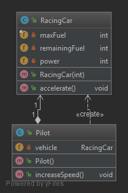
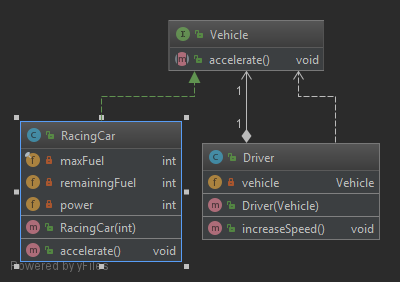

# DIP (Dependency Injection Principle)

La idea general de este principio es tan simple como importante: los módulos de alto nivel, que brindan una lógica compleja, deben ser fácilmente reutilizables y no verse afectados por los cambios en los módulos de bajo nivel, que brindan funciones de utilidad.

Para lograr eso, se deben introducir una abstracción que desacople los módulos de alto y bajo nivel entre sí.

La definición de este principio según _Robert C. Martin_ consta de dos partes:

* Los módulos de alto nivel no deben depender de módulos de bajo nivel. Ambos deberían depender de abstracciones.

* Las abstracciones no deben depender de los detalles. Los detalles deben depender de las abstracciones.

Un importante detalle de esta definición es que tanto los módulos de alto nivel como los de bajo nivel dependen de una abstracción. Por tanto no se invierte la dirección de la dependencia como cabría esperar por el nombre del principio sino que se divide la dependencia entre los módulos de alto y bajo nivel introduciendo una abstracción entre ellos.

Si se han aplicado correctamente el **_Open/Closed Principle_** y el **_Liskov Substitution Principle_** también se ha seguido este principio.

El **_Open/Closed Principle_** requiere que el componente esté abierto a extensión pero cerrado a modificación. Se puede lograr introduciendo interfaces para las que puede proporcionar diferentes implementaciones. La interfaz en sí misma está cerrada a modificaciones y puede ampliarse fácilmente proporcionando una nueva implementación de interfaz.

Sus implementaciones deben seguir el **_Liskov Substitution Principle_** para que pueda reemplazarlas con otras implementaciones de la misma interfaz sin "romper" la aplicación o sistema.

En el ejemplo tenemos la clase [Pilot](violation/Pilot.java) que tiene una dependencia con la clase [RacingCar](violation/RacingCar.java) ya que en su método constructor se construye una instancia de la clase [RacingCar](violation/RacingCar.java).  

Para introducir una abstracción que desacople ambas clases creamos la interfaz [Vehicle](solution/Vehicle.java) de forma que la clase [Pilot](solution/Pilot.java) en su constructor recibirá un objeto que implemente dicha interfaz. En el ejemplo la clase [RacingCar](solution/RacingCar.java) implementa dicha interfaz pero si hemos aplicado correctamente los otros principios podremos utilizar otras implentaciones y ampliar la funcionalidad del sistema sin que se produzcan errores.  

Este principio está relacionado con el concepto de **Inyección de Dependencias** ya que será otro sistema el que _inyecte_ en tiempo de ejecución la implementación que requiera la clase.
