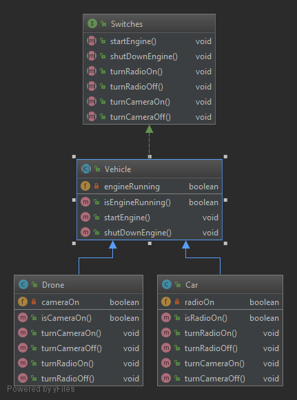
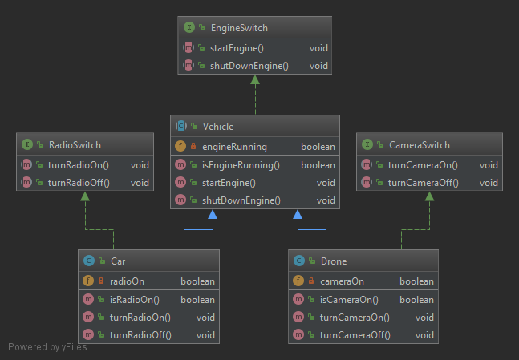

# ISP (Interface Segregation Principle)

> Clients should not be forced to depend upon interfaces that they do not use.  
> -- Robert C. Martin

El objetivo de este principio, al igual que el **_Single Responsibility Principle_** es reducir los efectos secundarios y la frecuencia de los cambios si dividimos el código en múltiples partes independientes.

Al seguir este principio se evitan interfaces infladas que definen métodos para múltiples responasiblidades.

En el ejemplo tenemos las subclases [Drone](violation/Drone.java) y [Car](violation/Car.java) que heredan de la superclase [Vehicle](violation/Vehicle.java) y a su vez esta clase implementa la interfaz [Switches](violation/Switches.java).  

En este ejemplo las subclases, debido a la herencia, se ven obligadas a implementar con un cuerpo vacío los métodos que no les son necesarios. Por ejemplo la subclase [Car](violation/Car.java) se ve obligada a implementar los métodos _turnCameraOn()_ y _turnCameraOff()_ que son más propios de la subclase [Dron](violation/Drone.java) y pasa lo mismo con los métodos _turnRadioOn()_ y _turnRadioOff()_

Para cumplir con el **_Interface Segregation Principle_** debemos refactorizar el código de forma que en vez de tener una única interfaz con demasiada responsabilidad tengamos tres interfaces con menor responsabilidad.  

Ahora la subclase [Drone](solution/Drone.java) implementa la interfaz [CameraSwitch](solution/CameraSwitch.java) y la subclase [Car](solution/Car.java) implementa la interfaz [RadioSwitch](solution/RadioSwitch.java).
