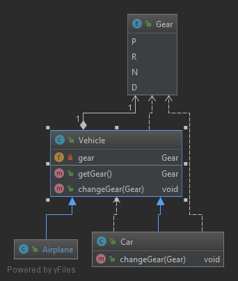
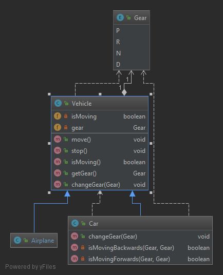

# LSP (Liskov Substitution Principle)

El **_Liskov Substitution Principle_** extiendel el **_Open/Closed Principle_** pero focalizando en el comportamiento de una superclase y sus subtipos de forma que si aplicamos este principio en nuestras clases e interfaces estaremos evitando todo tipo de efectos secundarios.

Este principio define que los objetos de una superclase deben ser reemplazables por objetos de sus subclases sin "romper" la aplicación o sistema. Eso requiere que los objetos de las subclases se comporten de la misma manera que los objetos de la superclase.

Para conseguir esto las subclases deberían seguir estas reglas:

* No implementar reglas de validación más estrictas en los parámetros de entrada que las implementadas por la clase base.

* Aplicar al menos las mismas reglas a todos los parámetros de salida aplicados por la clase base.

En el ejemplo tenemos las clases [Car](violation/Car.java) y [Airplane](violation/Airplane.java) que heredan de la clase [Vehicle](violation/Vehicle.java)  

Según el **_Liskov Substitution Principle_** deberíamos poder utilizar las clases [Car](violation/Car.java) o [Airplane](violation/Airplane.java) en lugar de la superclase [Vehicle](violation/Vehicle.java). Debido a que no se cumple este principio no se puede usar de forma indistinta la superclase o las subclases sin generar errores en la aplicación ya que la subclase [Car](violation/Car.java) tiene unas restricciones superiores a la superclase en el método _changeGear(Gear)_. En este método se lanza una _RuntimeException_ en función de ciertos parámetros de entrada. Esta excepción no se genera ni en la subclase [Airplane](violation/Airplane.java) ni en la superclase [Vehicle](violation/Vehicle.java) y por tanto no se pueden usar de forma indistinta. Si usamos la subclase [Car](violation/Car.java) deberemos captura o relanzar dicha excepción.

Si refactorizamos el método _changeGear_ en la subclase [Car](solution/Car.java) de forma que no se lancen excepciones de modo que ni los parámetros de entrada ni los parámetros de salida sean más restrictivos que la superclase conseguimos que se aplique el **_Liskov Substitution Principle_**  

