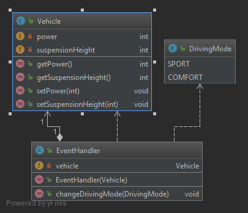
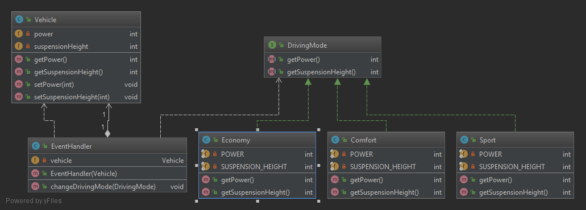

# OCP (Open/Closes Principle)

> "Software entities (classes, modules, functions, etc...) should be open for extension, but closed for modification."

La idea es escribir código de forma que sea posible añadir nuevas funcionalidades pero sin modificar el código existente. Esto previene situaciones en que al cambiar clases base haya que adaptar todas las clases dependientes.

Inicialmente este principio se basaba en el uso de la herencia pero Robert C. Martin y otros autores aprendieron con el tiempo que la herencia crea una fuerte dependencia entre las clases. Es mejor el uso de **interfaces** que el uso de la herencia.

El mayor beneficio es que las interfaces introducen una capa extra de abstración que otorga un bajo nivel de acoplamiento. Las implementaciones que hace cada clase de esa interfaz son independientes unas de otras y no necesitan compartir el código.

En el caso de que fuera beneficioso el compartir código sería mejor optar por la herencia o la composición.

### Clases de ejemplo

En el ejemplo tenemos la clase [EventHandler](violation/EventHandler.java) con un método _changeDrivingMode_ que permite cambiar ciertos parámetros de la clase [Vehicle](violation/Vehicle.java) según el modo de conducción. Este modo de conducción se codifica en una enumeración. 

El **_Open/Closed Principle_** se incumple ya que si tenemos que añadir un nuevo modo de conducción, deberemos añadir el nuevo modo en la enumeración y deberemos modificar el método _changeDrivingMode_ para tener en cuenta este nuevo modo.  

Para cumplir el **_Open/Closed Principle_** deberemos refactorizar el código de forma que el método _changeDrivingMode_ no necesite ser modificado si se añade nueva funcionalidad. Por tanto debe permanecer cerrado a la modificación.

Esto lo conseguimos haciendo uso de las _interfaces_ (en vez del uso de la herencia) de modo que en el método _changeDrivingMode_ utilizamos la interfaz [DrivingMode](solution/DrivingMode.java). Si necesitamos añadir un nuevo modo de conducción como por ejemplo [Economy](solution/Economy.java) únicamente será necesario añadir la nueva clase que herede de la interfaz [DrivingMode](solution/DrivingMode.java) para que el sistema tenga en cuenta el nuevo modo. El método _changeDrivingMode_ permanece inalterado y plenamente funcional ya que este método hace uso de la interfaz y ésta no se ha modificado.   

