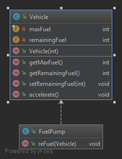

# SRP (Single Responsibility Principle)

> A class should have one, and only one, reason to change.  
> -- Robert C. Martin

Aplicable a clases, componentes de software o microservicios.

Ayuda a crear código de calidad, mantenible, reusable, testeable, fácil de implementar y previene de efectos secundarios en los cambios.

Los requerimientos del código pueden cambiar con el tiempo. Cada uno de éstos cambia al menos la responsabilidad de una clase.

Si una clase tiene muchas responsabilidades deberá cambiar más a menudo que si sólo tuviera una responsabilidad. Estos cambios tan reiterados pueden introducir errores o efectos secundarios en otras partes del código. Por tanto, una clase sólo debería cambiar por una única razón o lo que es lo mismo, que cambie la responsabilidad de la que se ocupa.

Las clases con una única responsabilidad son más fáciles de mantener y más fáciles de explicar.

En el ejemplo tenemos la clase [Vehicle](violation/Vehicle.java) que modela un objeto de tipo _Vehicle_ y que además tiene la responsabilidad del repostar el vehículo. Por tanto si cambia el modelo _Vehicle_ o si cambia la forma de repostar combustible esta clase tendrá dos motivos para cambiar y por tanto no cumple el *Principio de Responsabilidad Única*.  

Para aplicar el *Principio de Responsabilidad Única* deberemos crear una clase como por ejemplo [FuelPump](solution/FuelPump.java) cuya responsabilidad sea el repostaje de combustible del vehículo.  

