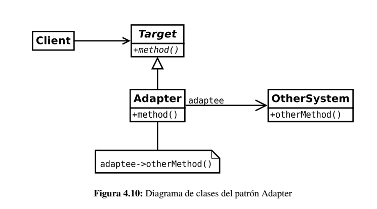

# Adapter

También conocido como *Wrapper* (envoltorio).

Este patrón se utiliza para proporcionar una interfaz que, por un lado, cumpla con las demandas de los clientes y, por otra,
haga compatible otra interfaz que, a priori, no lo es.

## Problema

Es muy problable que conforme avanza la construcción de la aplicación, el diseño de las interfaces que ofrecen los componentes
puedan no ser las adecuadas o, al menos, las esperadas por los usuarios de los mismos.

Una solución rápida podría ser adaptar dichas interfaces a las necesidades de la aplicación. Sin embargo, esto no siempre
es posible debido a que no sea posible modificar el código porque sea un requisito funcional, sea una biblioteca de terceros,
etc...

## Solución

Usando el patrón *Adapter* es posible crear una nueva interfaz de acceso a un determinado objeto, por lo que proporciona
un mecanismo de *adaptación* entre las demandas del objeto cliente y el objeto servidor que proporciona la funcionalidad.

## Implementación

En la siguiente imagen puede verse una implementación del patrón *Adapter*. El cliente no utiliza el sistema adaptado, si
no que hace uso del *adaptador*. Este es el que transforma la invocación a *method()* en *otherMethod()* 

Es posible que el adaptador también incluya nueva funcionalidad relacionada con la adaptación como por ejemplo: 

* Comprobación de la corrección de los parámetros. 

* Transformación de los parámetros para ser compatibles con el sistema adaptado.

## Consideraciones

* Tener sistemas muy reutilizables puede hacer que las interfaces no puedan ser compatibles con una en común. En ese caso
el patrón *Adapter* es una buena solución.

* Un mismo adaptador puede usarse en varios sistemas.

* Este patrón se parece al *Decorator*. Sin embargo, difieren en que la finalidad de éste es proporcionar una interfaz completa
del objeto adaptador, mientras que el decorador pueden centrarse en una sola parte.

## Enlaces
* [Adapter Pattern](https://es.wikipedia.org/wiki/Adapter_%28patr%C3%B3n_de_dise%C3%B1o%29)
