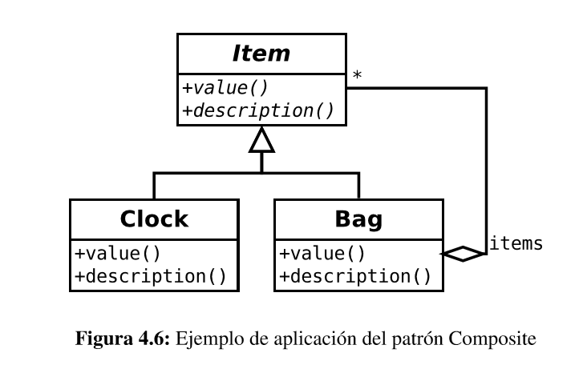

# Composite

Este patrón sirve para construir objetos complejos a partir de otros más simples y similares entre sí gracias a la
composición recursiva y a una estructura en forma de árbol.

Esto simplifica el tratamiento de los objetos creados ya que al poseer todos ellos una interfaz común, se tratan todos 
de la misma manera.

Una buena manera de identificar la situación en que se puede aplicar este patrón es cuando tengo "un X y tiene varios objetos X"

## Problema

Para ilustrar el problema supóngase un juego de estrategia en el que los jugadores pueden recoger objetos o items, 
los cuales tienen una serie de propiedades como "precio", "descripción"», etc. Cada item, a su vez, puede contener otros items. 
Por ejemplo, un bolso de cuero puede contener una pequeña caja de madera que, a su vez, contiene un pequeño reloj dorado.

En definitiva, el patrón *Composite* habla sobre cómo diseñar este tipo de estructuras recursivas donde la composición 
homogénea de objetos recuerda a una estructura arbórea.

## Solución

Como se puede ver, todos los objetos del ejemplo son de la clase *Items* que implementan una serie de métodos comunes.
En la jerarquia existen objetos compuestos, como *Bag*, que mantienen una lista de *items* donde residen los objetos
que contiene. 

Naturalmente, los objetos compuestos suelen ofrecer también operaciones para añadir, eliminar y actualizar.

Por otro lado, hay *objetos hoja* que no contienen más objetos, como es el caso de *Clock*

## Enlaces
* [Composite](https://es.wikipedia.org/wiki/Composite_%28patr%C3%B3n_de_dise%C3%B1o%29)
