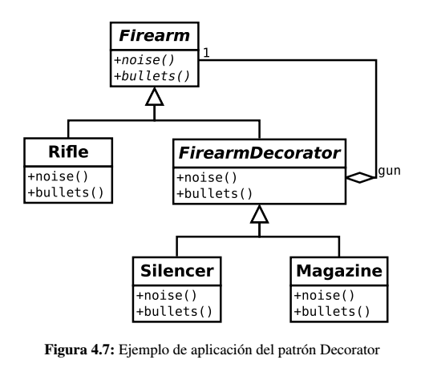

# Decorator

Sirve para añadir y/o modificar la responsabilidad, funcionalidad o propiedades de un objeto en tiempo de ejecución.

## Problema

Supongamos que el personaje de nuestro videojuego porta un arma que utiliza para eliminar a sus enemigos. Dicha arma,
por ser de un tipo determinado, tiene una serie de propiedades como podrían ser radio de acción, número de balas, etc..
Sin embargo, es posible que el personaje incorpore elementos al arma que pueden cambiar estas propiedades como un silenciador
o un cargador extra.

El patrón Decorator, permite organizar el diseño de forma que la incorporación de nueva funcionalidad en tiempo de 
ejecución a un objeto sea transparente desde el punto de vista del usuario de la clase *decorada*.

## Solución

Básicamente, los diferentes tipos de armas de fuego implementan una clase abstracta llamada *Firearm*. Una de sus hijas
es *FirearmDecorator* que es el padre de todos los componentes que "decoran" a un objeto *Firearm*. Nótese que este 
decorador implementa la interfaz propuesta por *Firearm* y está compuesto por un objeto *gun*, el cual decora.

## Consideraciones

Es un patrón similar al Composite pero con diferencias:

*  Está más centrado en la extensión de la funcionalidad que en la composición de objetos para la generación de una 
jerarquía como ocurre con el patrón Composite.

*  Normalmente, sólo existe una objeto decorado y no un vector de objetos (aunque también es posible)

Este patrón permite tener una jerarquía de clases compuestas, formando una estructura más dinámica y flexible 
que la herencia estática. Al utilizar este patrón, se pueden añadir y eliminar responsabilidades en tiempo de ejecución.
Además, evita la utilización de la herencia con muchas clases y también, la herencia múltiple (si fuera posible en el lenguaje utilizado)

Este patrón puede generar gran cantidad de objetos pequeños y parecidos que dificulta su identificación. 

## Enlaces
* [Decorator Pattern](https://es.wikipedia.org/wiki/Decorator_%28patr%C3%B3n_de_dise%C3%B1o%29)
