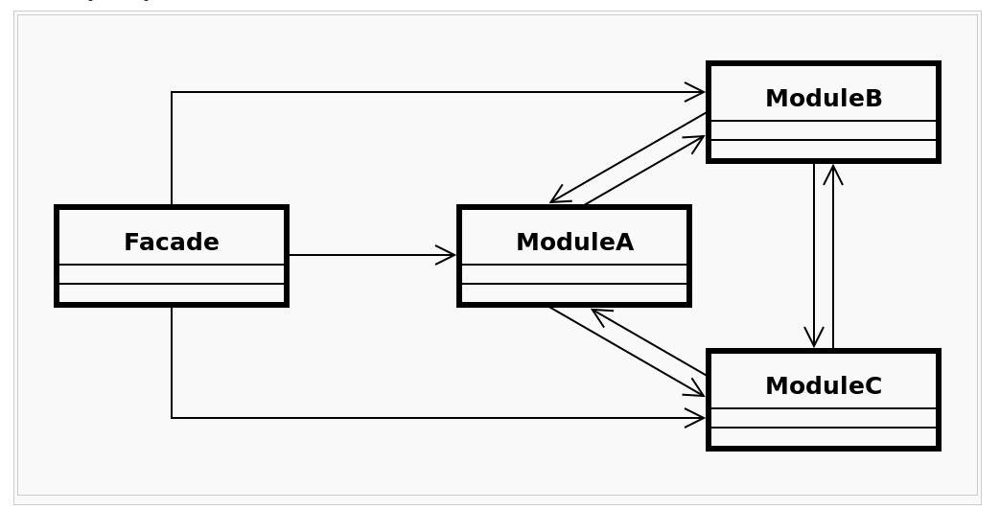

# Facade (patrón estructural)

Los patrones estructurales son los patrones de diseño software que solucionan problemas de composición (agregación) de clases y objetos.

El patrón ***Facade*** eleva el nivel de abstracción de un determinado sistema para ocultar ciertos detalles de implementación y hacer más sencillo su uso.

## Consideraciones

Se aplicará este patrón cuando se necesite proporcionar una interfaz simple para un subsistema complejo, o cuando se quiera estructurar varios subsistemas en capas ya que las fachadas serían el punto de entrada a cada nivel.

Otro escenario proclive para su aplicación surge de la necesidad de desacoplar un sistema de sus clientes y de otros subsistemas, haciéndolo más independiente, portable y reutilizable.

También es útil cuando haya que controlar el acceso y la forma en que se utiliza un sistema determinado.

Uno de los patrones relacionados es el patrón ***Singleton*** ya que normalmente las fachadas suelen ser instancias únicas.

* Facade - conoce qué clases del subsistema son responsables de una determinada peticíón y delega esas peticiones de los clientes a los objetos apropiados del subsistema. Los clientes no acceden directamente a las subclases.

* Subclases (ModuleA, ModuleB, ModuleC...) - implementan la funcionalidad del subsistema. Realizan el trabajo solicitado por la fachada. No conocen la existencia de la fachada.

## Ventajas

La principal ventaja consiste en que para modificar las clases del subsistema sólo hay que realizar los cambios en la interfaz/fachada y los clientes pueden permanecer ajenos a ello.

Esto permite el desacople de los clientes y eleva el nivel de abstracción.

## Inconvenientes

Crear clases fachada con un tamaño desproporcionado, conteniendo demasiado funcionalidad si no se divide correctamente las responsabilidades.

## Enlaces

* [Facade (patrón de diseño)](https://es.wikipedia.org/wiki/Facade_%28patr%C3%B3n_de_dise%C3%B1o%29)

## License

  
Esta obra está bajo una [licencia de Creative Commons Reconocimiento-Compartir Igual 4.0 Internacional](http://creativecommons.org/licenses/by-sa/4.0/).
