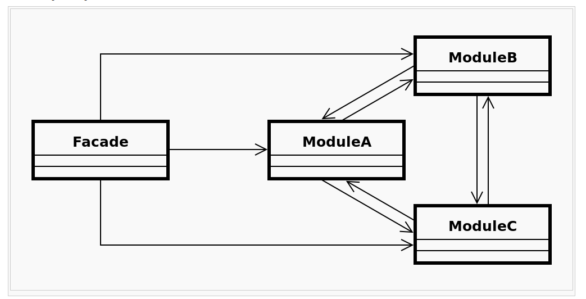

# Facade

Eleva el nivel de abstracción de un determinado sistema para ocultar ciertos detalles de implementación y hacer más
sencillo su uso

## Consideraciones

Se aplicará este patrón cuando se necesite proporcionar una interfaz simple para un subsistema complejo, o cuando se quiera 
estructurar varios subsistemas en capas ya que las fachadas serían el punto de entrada a cada nivel.

Otro escenario proclive para su aplicación surge de la necesidad de desacoplar un sistema de sus clientes y de otros
subsistemas, haciéndolo más independiente, portable y reutilizable.

También es útil cuando haya que controlar el acceso y la forma en que se utiliza un sistema determinado.

Uno de los patrones relacionados es el patrón *Singleton* ya que normalmente las fachadas suelen ser instancias únicas.

* Facade - conoce qué clases del subsistema son responsables de una determinada peticíón y delega esas peticiones de los clientes
a los objetos apropiados del subsistema. Los clientes no acceden directamente a las subclases.

* Subclases (ModuleA, ModuleB, ModuleC...) - implementan la funcionalidad del subsistema. Realizan el trabajo solicitado por la fachada.
No conocen la existencia de la fachada.

## Ventajas
La principal ventaja consiste en que para modificar las clases del subsistema sólo hay que realizar los cambios en la interfaz/fachada y los
clientes pueden permanecer ajenos a ello.

Esto permite el desacople de los clientes y eleva el nivel de abstracción.

## Inconvenientes

Crear clases fachada con un tamaño desproporcionado, conteniendo demasiado funcionalidad si no se divide correctamente las 
responsabilidades.

## Enlaces
* [Facade Pattern](https://es.wikipedia.org/wiki/Facade_%28patr%C3%B3n_de_dise%C3%B1o%29)

