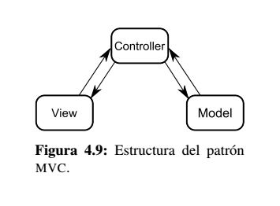

# MVC (patrón estructural)

Los patrones estructurales son los patrones de diseño software que solucionan problemas de composición (agregación) de clases y objetos.

El patrón ***MVC*** separa los datos y la lógica de negocio de una aplicación de la interfaz de usuario y el módulo encargado de gestionar los eventos y las comunicaciones.

Para ello el patrón ***MVC*** propone la construcción de tres componentes distintos que son el modelo, la vista y el controlador, es decir, por un lado define componentes para la representación de la información, y por otro lado para la interacción del usuario.

Este patrón de arquitectura de software se basa en las ideas de reutilización de código y la separación de conceptos, características que buscan facilitar la tarea de desarrollo de aplicaciones y su posterior mantenimiento.

## Implementación

* **Vista** - se trata de la interfaz de usuario que interactúa con el usuario y recibe las órdenes (pulsar un botón, introducir texto, etc...). También recibe órdenes desde el controlador para mostrar información o realizar un cambio en la interfaz.

* **Controlador** - el controlador recibe órdenes utilizando, habitualmente, manejadores o *callbacks* y traduce esa acción al dominio del modelo de la aplicación. La acción puede ser crear una nueva instancia de un objeto determinado, actualizar estados, pedir operaciones al modelo, etc...

* **Modelo** - el modelo de la aplicación recibe las acciones a realizar por el usuario, pero ya independientes del tipo de interfaz utilizado porque se utilizan, únicamente, estructuras propias del dominio del modelo y llamadas desde el controlador.

Normalmente, la mayoría de las acciones que realiza el controladro sobre el modelo son operaciones de consulta de su estado para que pueda ser convenientemente representado por la vista.

***MVC*** no es un patrón con una separación rígida. Es posible encontrar implementaciones en las que, por ejemplo, el modelo notifique directamente a las interfaces de forma asíncrona eventos prodcucidos en sus estructuras y que deber ser representados en la vista (siempre y cuando exista una aceptable independencia entre capas). Para ello es de gran utilidad el patrón **Observer**.

El patrón MVC se utiliza en un gran número de entornos de ventanas y sobretodo en entornos web.

Sin embargo, es la estructura más utilizada en los videojuegos: la interfaz gráfica utilizando gráficos 2D/3D (vista), bucle de eventos (controlador) y las estructuras de datos internas (modelo).

## Enlaces

* [MVC (patrón de diseño)](https://es.wikipedia.org/wiki/Modelo%E2%80%93vista%E2%80%93controlador)

## License

  
Esta obra está bajo una [licencia de Creative Commons Reconocimiento-Compartir Igual 4.0 Internacional](http://creativecommons.org/licenses/by-sa/4.0/).
