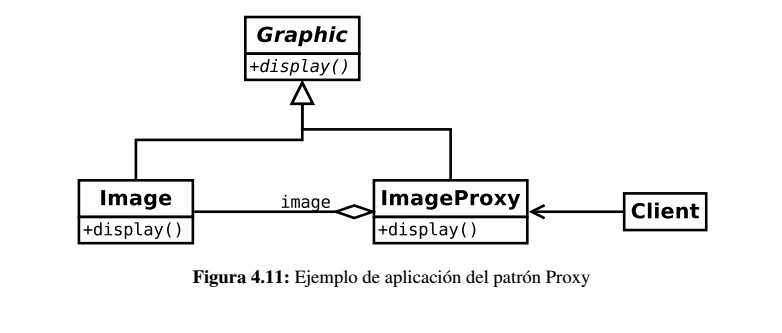

# Proxy (patrón estructural)

Los patrones estructurales son los patrones de diseño software que solucionan problemas de composición (agregación) de clases y objetos.

El patrón ***Proxy*** tiene como propósito proporcionar un subrogado o intermediario de un objeto para controlar su acceso.

## Problema

Muchos de los objetos de los que puede constar una aplicación pueden representar diferentes problemas a la hora de ser utilizados por la aplicación:

* **Coste computacional** - Es posible que un objeto sea costoso de manipular y cargar.

* **Acceso remoto** - el acceso por red es un componente cada vez más común.

* **Acceso seguro** - es posible que para usar determinados objetos se necesiten determinados privilegios.

* **Dobles de prueba** - a la hora de diseñar y probar el código se necesitan objetos *dobles* que simulen a los objetos reales

## Solución

Supongamos el costo de manipular y cargar una imagen. Con el patrón ***Proxy*** se crea un objeto intermedio *(ImageProxy)* que represente al objeto real *(Image)* y que se utilice de la misma forma desde el punto de vista del cliente.

De esta forma, el objeto *proxy* puede cargar una única vez la imagen y mostrarla tantas veces como el cliente lo solicite.

## Consideraciones

Existen ejemplos donde se hace un uso intensivo del patrón *Proxy* en diferentes sistemas:

* En los sistemas de autenticación, dependiendo de las credenciales presentadas por el cliente devuelven un proxy u otro que permiten realizar más o menos operaciones.

## Enlaces

* [Proxy (patrón de diseño)](https://es.wikipedia.org/wiki/Proxy_%28patr%C3%B3n_de_dise%C3%B1o%29)

## License

  
Esta obra está bajo una [licencia de Creative Commons Reconocimiento-Compartir Igual 4.0 Internacional](http://creativecommons.org/licenses/by-sa/4.0/).
