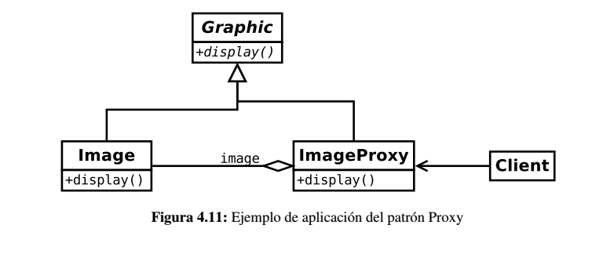

# Proxy

Es un patrón estructural que tiene como propósito proporcionar un subrogado o intermediario de un objeto para controlar su acceso.

## Problema

Muchos de los objetos de los que puede constar una aplicación pueden representar diferentes problemas a la hora de ser utilizados
por la aplicación:

* **Coste computacional** - Es posible que un objeto sea costoso de manipular y cargar.
 
* **Acceso remoto** - el acceso por red es un componente cada vez más común.
 
* **Acceso seguro** - es posible que para usar determinados objetos se necesiten determinados privilegios.

* **Dobles de prueba** - a la hora de diseñar y probar el código se necesitan objetos *dobles* que simulen a los objetos reales

## Solución

Supongamos el costo de manipular y cargar una imagen. Con el patrón *Proxy* se crea un objeto intermedio *(ImageProxy)* que
represente al objeto real *(Image)* y que se utilice de la misma forma desde el punto de vista del cliente.

De esta forma, el objeto *proxy* puede cargar una única vez la imagen y mostrarla tantas veces como el cliente lo solicite.

## Consideraciones

Existen ejemplos donde se hace un uso intensivo del patrón *Proxy* en diferentes sistemas:

* En los sistemas de autenticación, dependiendo de las credenciales presentadas por el cliente devuelven un proxy u otro
que permiten realizar más o menos operaciones.

## Enlaces
* [Proxy Pattern](https://es.wikipedia.org/wiki/Proxy_%28patr%C3%B3n_de_dise%C3%B1o%29)

License
-------
    Copyright (c) 2018 @alxgcrz <alxgcrz@outlook.com>
    
    Licensed under the Apache License, Version 2.0 (the "License");
    you may not use this file except in compliance with the License.
    You may obtain a copy of the License at
    
       http://www.apache.org/licenses/LICENSE-2.0
    
    Unless required by applicable law or agreed to in writing, software
    distributed under the License is distributed on an "AS IS" BASIS,
    WITHOUT WARRANTIES OR CONDITIONS OF ANY KIND, either express or implied.
    See the License for the specific language governing permissions and
    limitations under the License.
